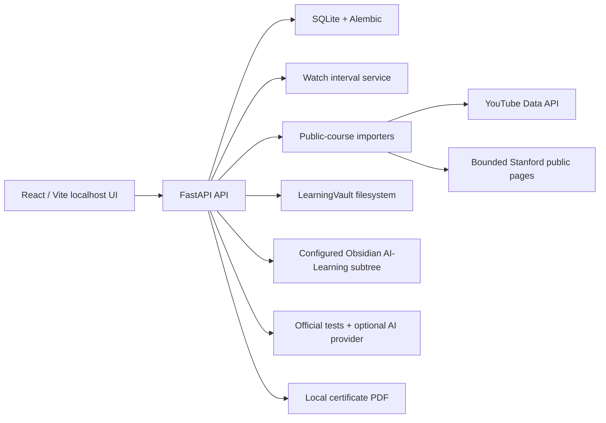

# Architecture



## Service boundaries

| Area | Main service | Key invariant |
| --- | --- | --- |
| Progress | `watch_progress.py` | Completion uses merged unique intervals, never a manual completion click. |
| YouTube | `youtube.py` | Only the official Data API supplies automatic playlist metadata. |
| Stanford | `stanford.py` | Starts from one URL, follows selected same-host pages only, respects robots and authentication boundaries. |
| Official work | `assignments.py` | An external assignment is official only when a public official course page links to it; provenance remains attached. |
| Notes | `obsidian.py` | The app writes only below the configured Vault's `AI-Learning/` subtree and never overwrites an existing generated note. |
| Grading | `grader.py` | Codex uses a copied, read-only workspace. OpenAI-compatible providers receive a copied Answer.md and bounded assignment context only. |
| Certificates | `certificates.py` | Eligibility is calculated from progress and public assignment records; the PDF never claims university accreditation. |

## Data model and provenance

`Resource.provenance` stores `course_name`, `course_version`, `year`, `quarter`, `official_course_url`, `source_page_url`, `resource_url`, `resource_type`, `title`, `detected_as_official`, `downloaded_at`, `local_path`, `checksum`, and `access_status`.

Downloaded official work follows this shape:

```text
LearningVault/
  cs336_spring-2026/
    assignments/
      a1/
        metadata.json
        original/
        workspace/
        submission/
```

The original folder is write-once in normal workflow. Every submitted `Answer.md` is copied to a versioned snapshot; `Submission`, `Grade`, and `GradingRun` preserve the historical record.

## Trust and external actions

- Import requests are read-only HTTP requests to user-supplied public course sources.
- Download requires a user click and is restricted to resources recorded by the importer.
- GitHub download is shallow clone only and never pushes or edits a remote.
- AI review requires an explicit UI acknowledgement. Codex receives a read-only staged workspace; compatible endpoints receive only the bounded request payload described above.
- Opening a workspace uses a user-clicked endpoint and accepts only a validated LearningVault child path.
