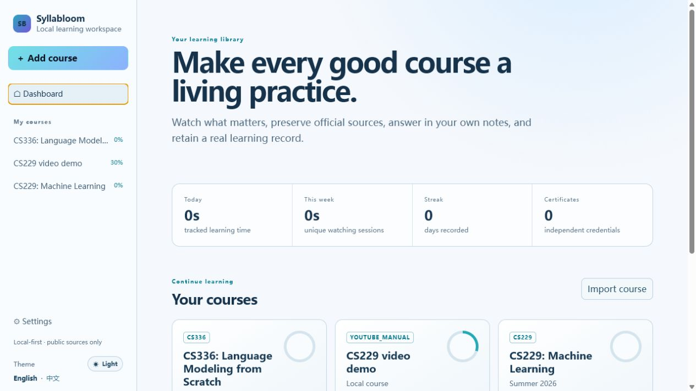
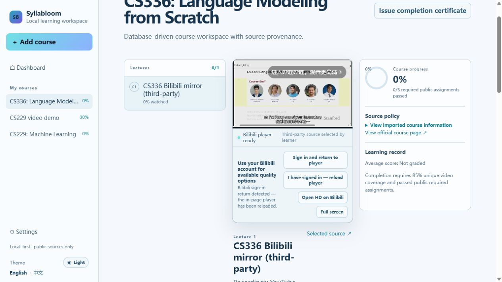
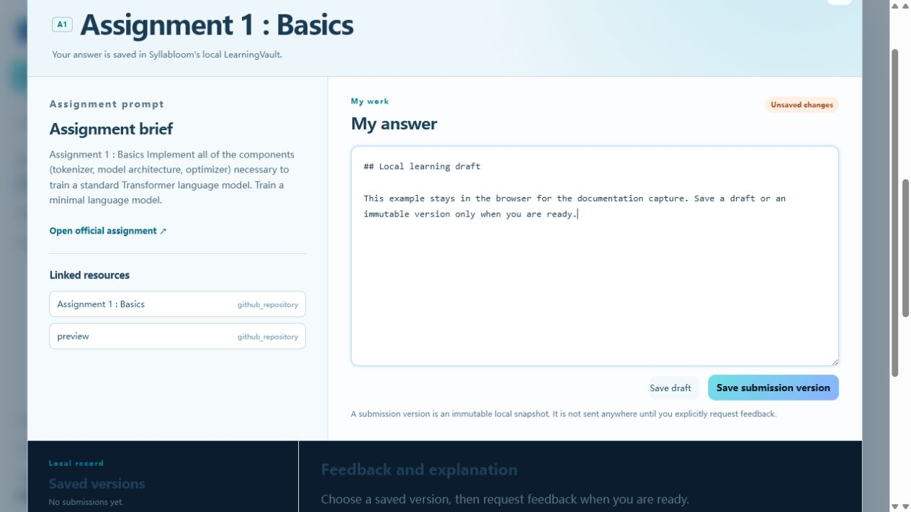
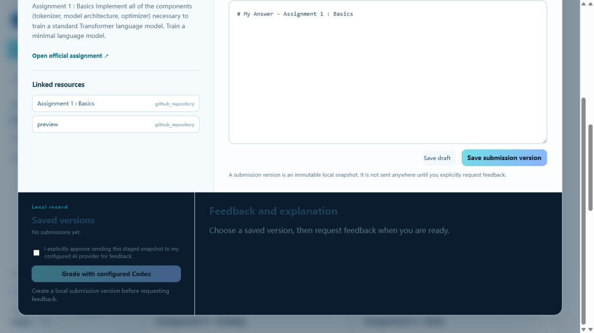
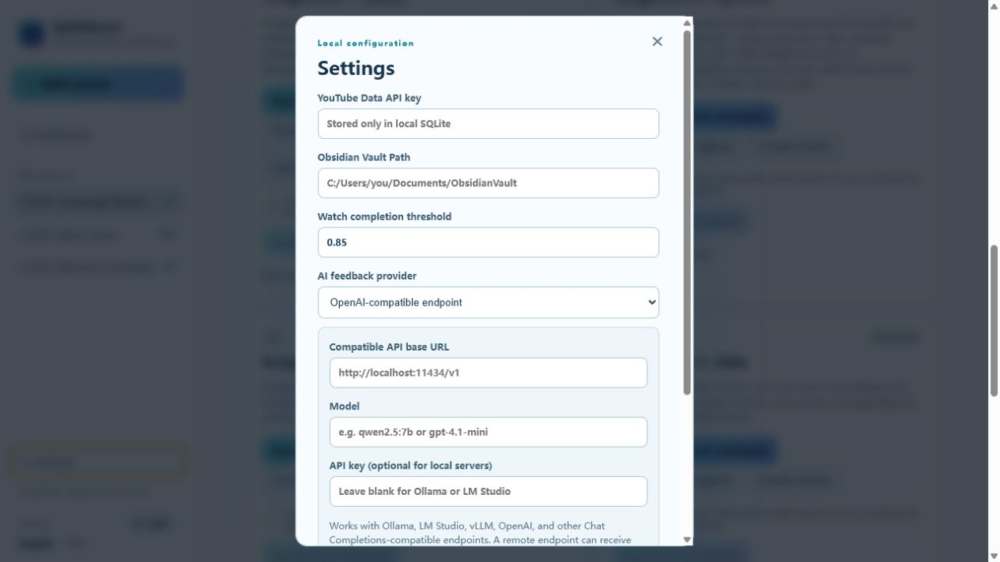
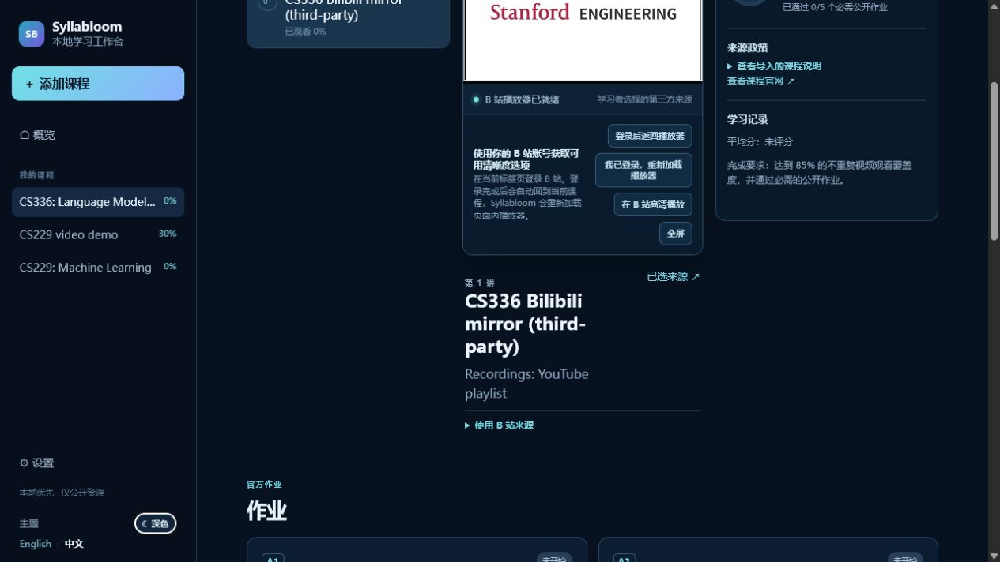
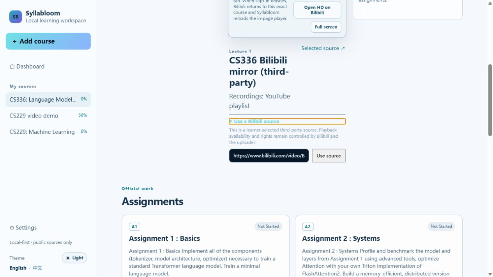
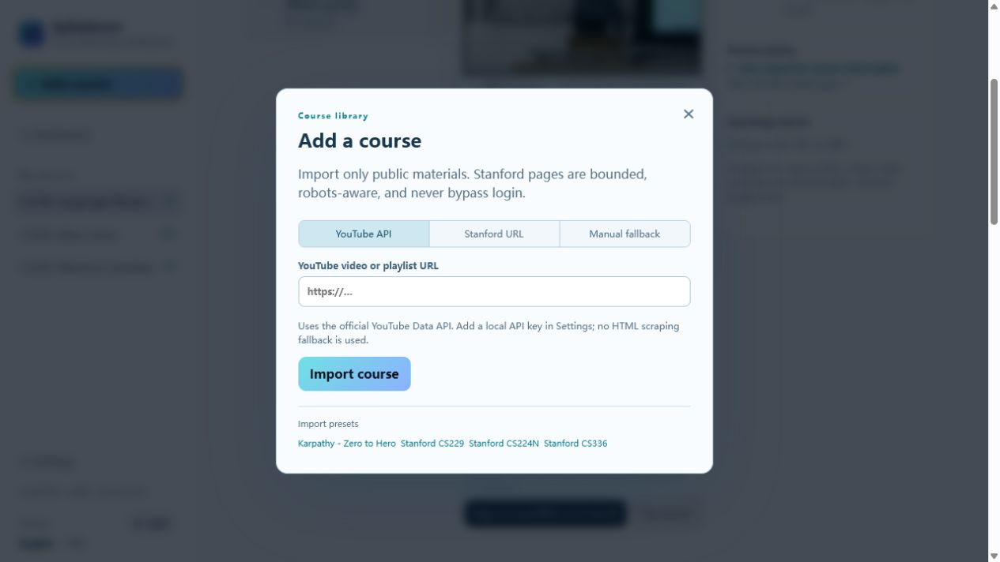

# Syllabloom 功能图文说明

[English](FEATURE_TOUR.md)

以下图片均来自本地运行的 Syllabloom。截图中没有账号密码、Cookie、API Key、已提交作业或 AI 生成答案；作业编辑器里的简短文字只是未保存的说明示例。

## 1. 本地课程库

仪表盘是你导入课程的本地索引。课程进度、本地记录和证书都保留在自己的机器上，无需注册 Syllabloom 账号。

## 2. 在课程页内播放 B 站视频

B 站视频会留在课程工作区内播放。点击 **登录后返回播放器** 会在当前标签页打开 B 站官方登录页；回跳地址会带上当前课程和讲次，因此登录成功后会回到同一门课程、滚动回播放器、清除一次性回跳参数，并自动重新加载页面内 iframe。Syllabloom 不会读取 B 站密码、二维码或 Cookie。

此截图在本地模拟了登录完成后的回跳路径，并未使用任何 B 站账号。实际可选清晰度仍由 B 站、视频和账号决定。如果浏览器阻止第三方 Cookie，或 B 站限制 iframe 播放器，可主动使用 **在 B 站高清播放** 作为回退。

## 3. 在网页内完成作业

每个导入的公开作业都有独立工作台：左侧保留公开题目说明与资源，右侧是 Markdown 编辑器。可随时保存本地草稿，再创建不可变的本地提交版本。只有你选定某个版本并明确确认后，内容才会发送给已配置的 AI 提供方。

## 4. 已版本化的反馈安全边界

只有在本地提交版本已经存在，并且学习者为该确切版本勾选确认后，反馈区域才会启用。这样可以避免草稿被意外发送，也能让任何 AI 结果始终绑定到稳定的本地快照。截图特意展示评分前状态；为了制作文档，没有调用任何已配置的 AI 提供方。

## 5. 本地 AI 与 Obsidian 配置

设置页支持现有 Obsidian Vault、完成度阈值、Codex CLI，以及 Ollama、LM Studio、vLLM 等兼容 OpenAI 的端点。密钥只保存在本地应用数据库中，设置接口不会把它返回到网页；图中可见的是占位符，不是实际密钥。

## 6. 英文默认、中文与深色主题

首次启动默认英文。侧栏底部可切换中文以及浅色/深色主题，浏览器会记住选择。课程标题与第三方来源文本会按导入时的原样保留。

## 7. 绑定学习者选择的 B 站来源

在任一讲次下粘贴含 `BV...` 标识的直接 B 站视频链接即可绑定。它会被明确标注为学习者选择的第三方来源；播放权利和可用性由 B 站与上传者控制，绝不会被重新标注为课程官方材料。

## 8. 导入公开课程

可通过官方 YouTube Data API 导入公开视频或播放列表、使用手动公开视频备用方式，或导入有边界的公开 Stanford 课程 URL。需要登录的资源会作为受保护来源记录，不会穿过访问控制去抓取。

## 推荐学习流程

1. 导入公开课程并核对来源链接。
2. 在页面内观看可嵌入讲次；B 站视频通过 B 站官方页面登录后自动回到页面内播放器。
3. 打开作业，在本地撰写并保存草稿或不可变版本。
4. 只有需要反馈时才配置 Codex CLI 或兼容 AI 提供方。
5. 选择已保存版本并明确确认后再请求反馈；结果会绑定到该本地快照。

完整操作与隐私边界请查看 [用户指南](USER_GUIDE.zh-CN.md)。
